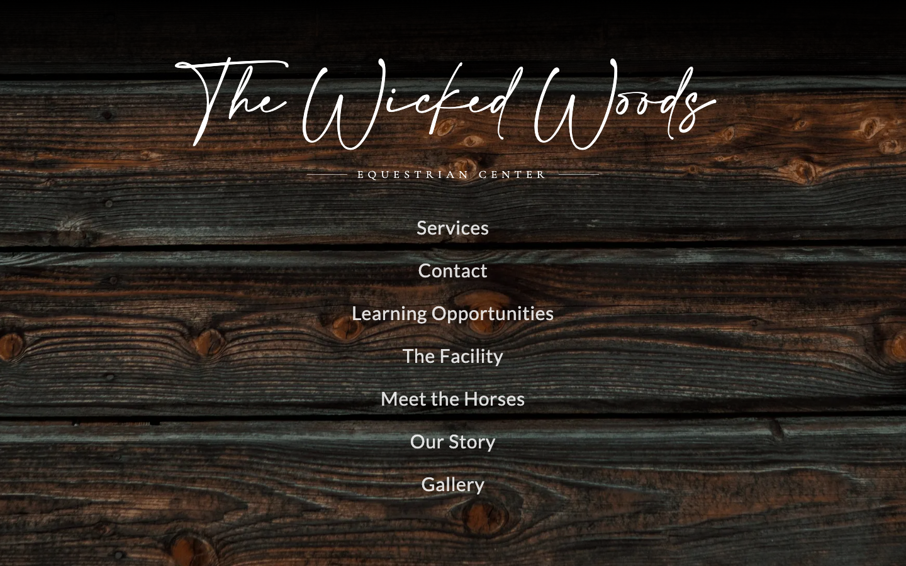

# The Wicked Woods

A responsive website for The Wicked Woods Equestrian Center, built to showcase boarding, lessons, horses, facilities, gallery content, and contact options.

**Live demo:** [wicked-woods.vercel.app](https://wicked-woods.vercel.app)



## What It Does

The Wicked Woods site gives the equestrian center a complete public-facing web presence:

- Atmospheric homepage with brand hero, story section, and client-oriented copy.
- Services page for boarding details and additional offerings.
- Learning opportunities page for lesson information.
- Meet the Horses page with individual horse profiles.
- Facility and gallery pages for visual exploration.
- Contact form that sends inquiries through Resend.
- Responsive navigation and animated content reveals.

## Tech Stack

- Next.js 16 App Router
- React 19
- TypeScript
- Tailwind CSS v4
- Framer Motion
- Resend
- Next Image optimization
- Vercel for deployment

- ## CI/CD

- **CI** — GitHub Actions runs the Jest suite on every push and pull request (see the badge above).
- **CD** — Deployment is handled automatically by Vercel, which builds and ships every push to `main`.

## Run Locally

```bash
npm install
npm run dev
```

Then open [http://localhost:3000](http://localhost:3000).

## Environment Variables

The contact form requires:

- `RESEND_API_KEY`

## Project Status

This is a production-style client website with the core marketing and inquiry flows in place. Future improvements could include booking requests, a CMS for gallery updates, and expanded horse profile pages.

## License

Private client project for The Wicked Woods Equestrian Center. Not intended for public redistribution.
